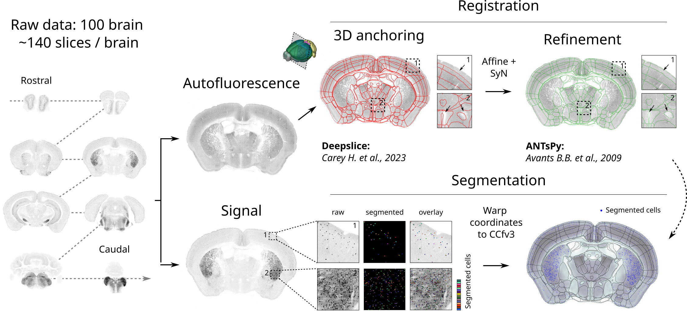
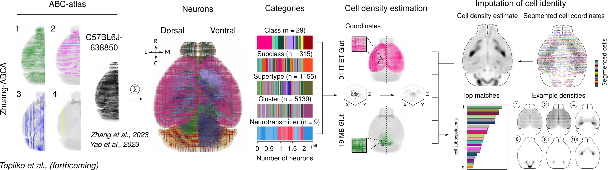

# 🧭 CellMap2D

This repository provides a modular pipeline for registering and visualizing histological sections and spatial transcriptomics (ST) data aligned to a 3D reference brain atlas. The pipeline enables automatic slice orientation prediction with **DeepSlice**, high-quality image registration with **ANTsPy**, and accurate deformation-aware projection of ST coordinates.

---

## 🧩 Features

- Download **raw .zarr files** from s3 buckets
- Basic segmentation
- Automatic 3D slice anchoring using **DeepSlice**
- Registration refinement with **ANTsPy** (Affine + SyN)

## 🔁 Workflow Overview

The pipeline follows a modular structure. Each step is configured via the main config.yml file located in the config/ folder and executed using scripts in the scripts/ directory.

Here is the recommended order of operations:

1. **Edit configuration files**
Customize paths, processing options, and sample metadata in the `config.yml` file

2. **Download raw data** 
Fetch required reference volumes, atlases, or input datasets.

```bash
python scripts/download_data.py
```

3. **Prepare samples**
Format and clean input samples for registration.

```bash
python scripts/prepare_samples.py
```

4. **Segment tissue sections**
Use Cellpose or blob detection to extract cell locations from histological images.

```bash
python scripts/segment_cells.py
```

5. **Predict slice orientation using DeepSlice**
Estimate the anatomical slice angle and location from the 3D atlas.

```bash
python scripts/run_deepslice.py
```

6. **Register and refine alignment in 2D using ANTs**
Apply affine and SyN transformations to align the histological image with the extracted atlas slice.

Example output from segmentation and registration steps:


7. **Generate subclass KDEs (density maps)**
Create density maps for known subclasses in atlas space.

```bash
python scripts/generate_subclass_kde.py
```

8. **Generate KDE from your segmented data**
Build a density map from your sample's segmented cells.

```bash
python scripts/generate_test_kde.py
```

9. **Rank subclasses by similarity to the sample**
Compare the test KDE against reference subclass KDEs and rank them by similarity.

```bash
python scripts/rank_subclasses.py
```
  
Example of spatial transcriptomics integration and deformation-aware overlay:


## 📦 Installation

### 1. Clone the repository

```bash
git clone https://github.com/Tom-top/CellMap2D.git
cd CellMap2D
```

### 2. Create the environment

```bash
conda env create -f env/env.yml
conda activate CellMap2D
```

## 📚 References

ANTs/ANTsPy: [Avants B.B. et al., Insight j, 2009](https://psychiatry.ucsd.edu/research/programs-centers/snl/_files/ants2.pdf)

DeepSlice: [Carey H. et al., Nature Communications, 2023](https://www.nature.com/articles/s41467-023-41645-4)

ABC Atlas: [Yao Z. et al., Nature, 2023](https://www.nature.com/articles/s41586-023-06812-z);
[Zhang M. et al., Nature, 2023](https://www.nature.com/articles/s41586-023-06808-9)

## ✍️ Author

Developed by Thomas Topilko and Silas Dalum Larsen, 2025.

