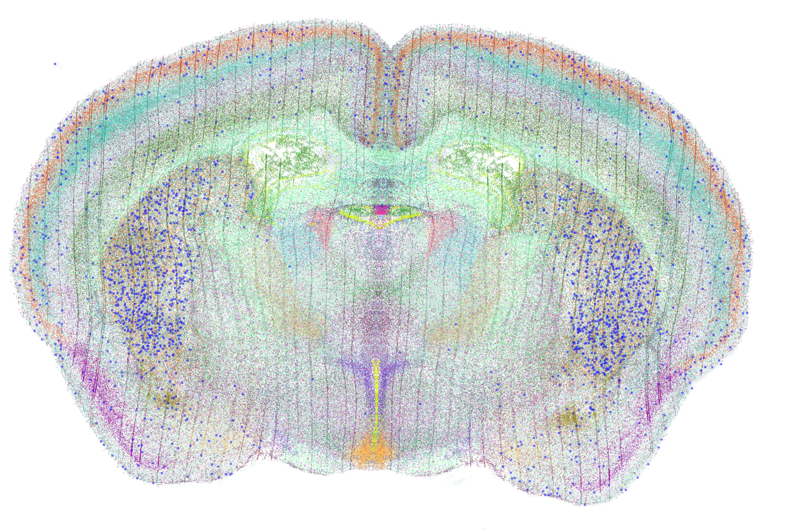

# 🧭 CellMap2D

**CellMap2D** is a Python-based pipeline created for the **MapMySections** challenge of the **Allen Brain Institute**: https://alleninstitute.org/events/mapmysections/.
This work has been performed by **Thomas Topilko** and **Silas Dalum Larsen**.


The general aim of the challenge is to **impute the transcriptional identity of labeled cells in 2D histological sections**.

The available data included **high-resolution 2D histological slices** and **25µm isotropic volumes of registered signal 
intensity**.

However, since our goal was to infer the identity of labeled cells, we determined that the 25µm volumes were not 
suitable for this purpose. These volumes are based on global fluorescence intensity rather than true cell segmentation, 
meaning much of the signal originates from fiber tracts, dendrites, and other non-somatic structures.

## 📦 Installation

### 1. Clone the repository

```bash
git clone https://github.com/Tom-top/CellMap2D.git
cd CellMap2D
```

### 2. Create the environment

```bash
conda env create -f env/env.yml
conda activate CellMap2D
```


## 🧩 Step-by-step overview of the pipeline

Below is a high-level, step-by-step overview of the pipeline we developed for this challenge:

1. **Edit the configuration file**

The pipeline is initialized using a `config/config.yml` file, which defines the parameters controlling its behavior. 
This file should be customized to configure input paths, processing settings, and sample-specific metadata.
Each entry in the file is annotated to explain what the parameters do.

[NOTE] All the future parts of the pipeline can be executed sequentially by running the `n_*.py` scripts in the 
`scripts/` folder.

2. **Download raw data**

The first step is to download the raw .zarr data. Since the data is at very high resolution (hundreds of Gb per brain)
we download a downsampled version of each brain dataset `resolution_level: 2` parameter in the `config/config.yml` file.
The idea being to have a dataset of a manageable size, with enough resolution to segment individual cells efficiently.

```bash
python scripts/1_download_samples.py
```

3. **Segment cells of tissue sections**

Once the data is downloaded, the next step is cell segmentation. While many approaches are available, we opted for a 
fast and **lightweight blob-detection algorithm**. Although this method does not yield perfect segmentation, it captures
the global distribution of labeled cells effectively and runs significantly faster than deep learning-based 
alternatives.

We also evaluated more advanced options, including [Cellpose](https://github.com/MouseLand/cellpose) 
and a fine-tuned version of the recently published 
[Cellpose-SAM](https://www.biorxiv.org/content/10.1101/2025.04.28.651001v1) model. While these methods produced 
excellent results, they were too computationally intensive to complete within the time constraints of the challenge.

```bash
python scripts/2_segment_samples.py
```

4. **Prepare samples for registration**

The next step is to generate downsampled version of the autofluorescence images (either the red or green channel 
depending on the samples) for the upcoming registration. Here once again the `downsampling_factor: 10` 
parameter controls the level of downsampling of the original data.

```bash
python scripts/3_prepare_samples.py
```

5. **Anchoring the slice in the 3D reference space**

Once downsampled, we run [DeepSlice](https://github.com/PolarBean/DeepSlice) to anchor each slice in the 3D reference
(CCFv3) space. The idea here is to generate an image of a reference slice that reflects the original image.

```bash
python scripts/4_run_deepslice_prediction.py
```

6. **Register and refine alignment in 2D using**

The predicted slices will not perfectly match the raw histological images. To refine the alignment, we perform 2D
image registration between the extracted reference slice and the raw data. This step is carried out using 
[ANTsPy](https://antspy.readthedocs.io/en/latest/), 
applying a standard **Affine + Non-linear (SyN)** transformation to warp the reference slice onto the histological image.

```bash
python scripts/5_refine_registration.py
```

Here is a figure outlining the steps of the pipeline explained so far:


Just because it looks beautiful ⭐ — here is a visualization of the cells from the ABC Atlas dataset
(colored by subclass) overlaid on the raw histological slice, with the segmented cells from the raw data 
shown in blue.



7. **Generate density maps for the spatial transcriptomics subpopulations**

Once all cells have been segmented and each slice registered to the reference atlas, we obtain a set of **3D registered
coordinates (x, y, z)** spanning the entire brain. The next step is to infer the transcriptional identity of the
labeled cell populations within each dataset.

To infer the identity of segmented cells, we decided to compare their spatial distribution to 
known KDE (kernel density estimate) maps of different subclasses from the 
[ABC-Atlas](https://portal.brain-map.org/atlases-and-data/bkp/abc-atlas), and rank the most likely matches 
based on how closely the patterns align. 

The first step is to generate an approximation of the KDE for each spatial transcriptomics subpopulations:

```bash
python scripts/6_generate_subclass_densities.py
```

8. **Generate density maps from your segmented datasets**

We then build a similar map the the segmented datasets:

```bash
python scripts/7_generate_sample_densities.py
```

9. **Rank populations by similarity to the sample**

To infer cell identity, we compute a **similarity score** between the test KDE (from segmented cells) and each known 
subclass KDE. This score combines two components: the **mean squared error (MSE)**, which measures how closely the 
spatial distributions align within relevant regions, and a **penalty term** that discourages false positives by 
penalizing signal in the test KDE where the subclass KDE shows little or none. The final similarity score is the 
inverse of the sum of MSE and penalty, so that higher scores indicate better matches. This allows us to rank 
subclasses based on how well their spatial patterns match the observed data.

```bash
python scripts/8_rank_sample_vs_subclass_densities.py
```

Here is a figure outlining the steps integrating the ABC-atlas with the segmented and registered 2D data:


## 📚 References

ANTs/ANTsPy: [Avants B.B. et al., Insight j, 2009](https://psychiatry.ucsd.edu/research/programs-centers/snl/_files/ants2.pdf)

DeepSlice: [Carey H. et al., Nature Communications, 2023](https://www.nature.com/articles/s41467-023-41645-4)

ABC Atlas: [Yao Z. et al., Nature, 2023](https://www.nature.com/articles/s41586-023-06812-z);
[Zhang M. et al., Nature, 2023](https://www.nature.com/articles/s41586-023-06808-9)

## ✍️ Author

Developed by Thomas Topilko and Silas Dalum Larsen, 2025.

